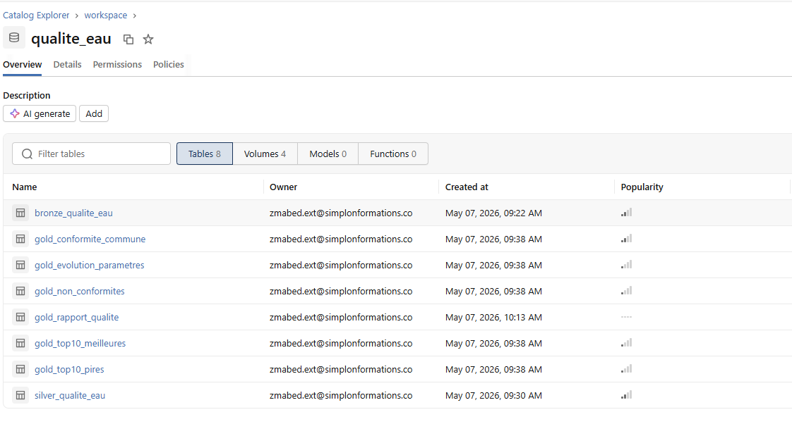
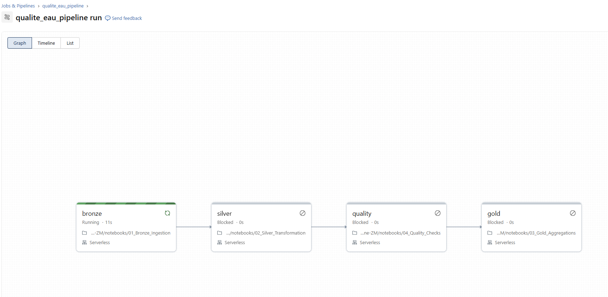
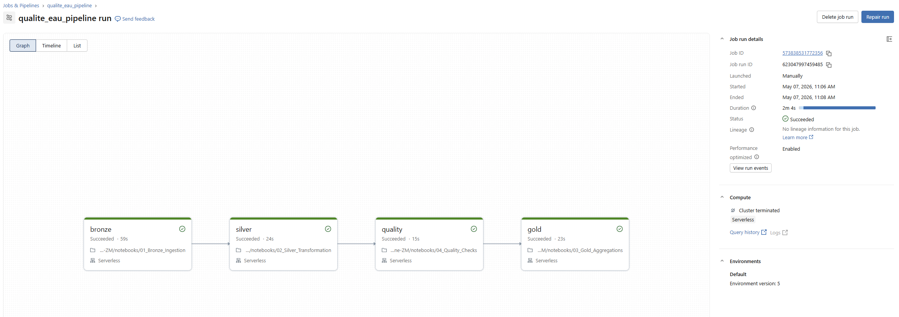
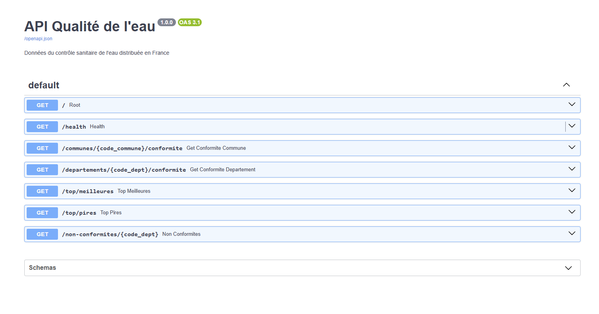
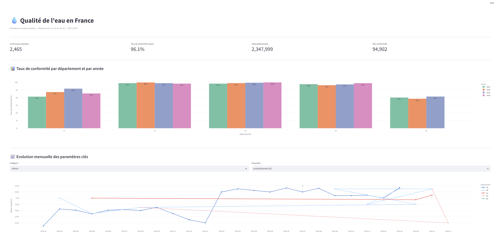
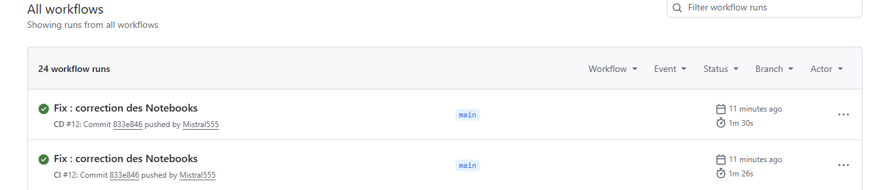

# Pipeline Qualité de l'Eau en France

> Pipeline de data engineering complet pour analyser les données du contrôle sanitaire de l'eau distribuée commune par commune en France.

**Auteur** : Zoubir MABED  
**Formation** : Simplon — Data Engineer  
**Date** : Mai 2026

---

## Présentation

Ce projet construit un pipeline de données de bout en bout pour traiter et analyser les données publiques de qualité de l'eau potable en France. Les données proviennent de l'**API Hub'Eau** (hubeau.eaufrance.fr) et couvrent 5 départements du Sud-Ouest (31, 33, 40, 64, 65) sur les années 2023 à 2025, représentant près d'**1 million d'analyses** de paramètres microbiologiques, chimiques et radiologiques.

---

## Architecture

```
API Hub'Eau (hubeau.eaufrance.fr)
        │
        ▼
src/ingestion/download.py
(téléchargement JSON par département)
        │
        ▼
/Volumes/workspace/qualite_eau/raw/
(stockage Databricks Unity Catalog)
        │
        ▼
┌───────────────────────────────────────────────────┐
│              DATABRICKS FREE EDITION              │
│                                                   │
│  01_Bronze  →  02_Silver  →  04_Quality  →  03_Gold │
│                                                   │
│  Unity Catalog — Delta Lake — Serverless          │
└───────────────────────────────────────────────────┘
        │                          │
        ▼                          ▼
  API FastAPI                Dashboard Streamlit
  (localhost:8000)            (localhost:8501)
        │
        ▼
   GitHub Actions
   CI/CD + Semantic Release
```

### Architecture médaillon

| Couche | Table | Lignes | Description |
|--------|-------|--------|-------------|
| **Bronze** | `bronze_qualite_eau` | ~984 000 | Données brutes JSON telles qu'ingérées, partitionnées par département et année |
| **Silver** | `silver_qualite_eau` | ~2 347 000 | Données nettoyées, typées, enrichies (catégories, conformité, valeurs numériques) |
| **Gold** | `gold_conformite_commune` | — | Taux de conformité par commune et année |
| **Gold** | `gold_evolution_parametres` | — | Evolution mensuelle des paramètres chimiques et microbiologiques |
| **Gold** | `gold_top10_meilleures` | 10 | Communes avec 100% de conformité |
| **Gold** | `gold_top10_pires` | 10 | Communes avec 0% de conformité |
| **Gold** | `gold_non_conformites` | — | Analyse des non-conformités par département et catégorie |
| **Gold** | `gold_rapport_qualite` | — | Rapport de validation qualité des données |

---

## Stack technique

| Composant | Technologie |
|-----------|-------------|
| Cloud compute | Databricks Free Edition (Serverless) |
| Stockage | Unity Catalog — Delta Lake |
| Traitement | PySpark |
| Qualité des données | Great Expectations (local) + PySpark checks (Databricks) |
| Orchestration | Databricks Workflows (Lakeflow Jobs) |
| Versionning | Git + GitHub |
| CI/CD | GitHub Actions + Semantic Release |
| API | FastAPI + Uvicorn |
| Dashboard | Streamlit + Plotly |
| Source de données | API Hub'Eau v1 |

---

## Structure du projet

```
qualite-eau-pipeline/
├── .github/
│   └── workflows/
│       ├── ci.yml              # Lint + tests automatiques
│       └── cd.yml              # Semantic Release + déploiement Databricks
├── app/
│   └── dashboard.py            # Dashboard Streamlit
├── api/
│   └── main.py                 # API FastAPI
├── notebooks/
│   ├── 00_Setup.ipynb          # Initialisation Unity Catalog
│   ├── 01_Bronze_Ingestion.ipynb
│   ├── 02_Silver_Transformation.ipynb
│   ├── 03_Gold_Aggregations.ipynb
│   └── 04_Quality_Checks.ipynb
├── src/
│   ├── ingestion/
│   │   └── download.py         # Téléchargement via API Hub'Eau
│   └── quality/
│       └── expectations_suite.py # Validation Great Expectations (local)
├── tests/
│   ├── conftest.py
│   └── test_silver.py
├── docs/
│   ├── images/                 # Captures d'écran du projet
│   └── quality_reports/        # Rapports Great Expectations
├── resources/
│   └── README.md               # Documentation du bundle Databricks
├── databricks.yml              # Databricks Asset Bundle
├── requirements.txt
├── .env.example
└── README.md
```

---

## Installation et démarrage

### Prérequis

- Python 3.11
- Git
- Compte Databricks Free Edition
- Compte GitHub

### 1. Cloner le repo

```bash
git clone https://github.com/Simplon-DE-P1-2025/Brief-6-Qualite-Eau-Pipeline-ZM.git
cd Brief-6-Qualite-Eau-Pipeline-ZM
```

### 2. Créer l'environnement virtuel

```bash
python -m venv .venv
# Windows
.venv\Scripts\Activate.ps1
# Mac/Linux
source .venv/bin/activate

pip install -r requirements.txt
```

### 3. Configurer les variables d'environnement

```bash
cp .env.example .env
```

Remplis `.env` avec tes credentials Databricks :

```
DATABRICKS_HOST=https://dbc-XXXX.cloud.databricks.com
DATABRICKS_TOKEN=dapiXXXXXXXXXXXXXXXX
DATABRICKS_HTTP_PATH=/sql/1.0/warehouses/XXXXXXXXXX
DATABRICKS_CATALOG=workspace
DATABRICKS_SCHEMA=qualite_eau
```

### 4. Télécharger les données

```bash
python -m src.ingestion.download
```

Le script appelle l'API Hub'Eau et télécharge les résultats d'analyses pour les départements 31, 33, 40, 64 et 65 sur les années 2023, 2024 et 2025. Les fichiers JSON sont stockés dans `data/raw/dept_XX/`.

### 5. Uploader vers Databricks

```bash
databricks configure --token
databricks fs cp data/raw/dept_64/resultats_2024.json \
  "dbfs:/Volumes/workspace/qualite_eau/raw/dept_64/resultats_2024.json"
```

---

## Pipeline de données

### Étape 1 — Setup Unity Catalog

Création du schema `qualite_eau` et des 4 volumes (`raw`, `bronze`, `silver`, `gold`) dans le catalog `workspace` de Databricks.

### Étape 2 — Bronze (ingestion)

Lecture des fichiers JSON depuis le volume `raw`, ajout des métadonnées d'ingestion (`_ingestion_timestamp`, `_departement`, `_annee`) et écriture en table Delta partitionnée.

### Étape 3 — Silver (transformation)

Nettoyage et enrichissement :
- Explosion des arrays `code_reseau` et `nom_reseau`
- Extraction des valeurs numériques depuis les résultats alphanumériques (`7,3` → `7.3`, `<0,01` → `0.01`)
- Catégorisation des paramètres (microbiologie, chimie, radioactivité)
- Calcul de l'indicateur de conformité basé sur l'analyse des phrases complètes de conclusion
- Enrichissements temporels (année, mois, trimestre)

> **Note sur la conformité** : les conclusions de l'API Hub'Eau sont des phrases longues en français (ex: *"Eau d'alimentation conforme aux limites de qualité et non conforme aux références de qualité"*). La logique de classification distingue la non-conformité aux **limites réglementaires** (vrai problème sanitaire → `False`) de la non-conformité aux **références de qualité** (seuil indicatif non contraignant → `True`).

### Étape 4 — Gold (agrégations)

Production de 5 tables analytiques :
- Taux de conformité par commune et année
- Evolution mensuelle des paramètres clés
- Top 10 communes les plus et moins conformes
- Analyse des non-conformités par département et catégorie



*Tables Delta créées dans Unity Catalog workspace.qualite_eau*

---

## Orchestration

Le pipeline est orchestré par **Databricks Workflows** (Lakeflow Jobs) :



*Démarrage du pipeline avec bronze en cours d'exécution*



*Pipeline complet exécuté avec succès en 2 minutes 4 secondes*

Le job tourne automatiquement tous les jours à 02h00 (Europe/Paris) et peut être déclenché manuellement.

---

## Qualité des données

### Great Expectations (local)

Great Expectations est exécuté **en local** sur un échantillon des données brutes. Cette approche a été choisie suite à une incompatibilité entre Great Expectations et le compute Serverless de Databricks (`PERSIST TABLE is not supported on serverless compute`).

La validation porte sur 7 règles :
- Existence des colonnes obligatoires (`code_commune`, `date_prelevement`, `libelle_parametre`)
- Absence de valeurs nulles sur les colonnes clés
- Format du code commune (5 chiffres)
- Valeurs valides pour `conclusion_conformite_prelevement`

```bash
python -m src.quality.expectations_suite
```

Les rapports sont sauvegardés dans `docs/quality_reports/`.

### Checks PySpark (Databricks)

En complément, le notebook `04_Quality_Checks` exécute des validations natives PySpark directement sur la table Silver dans Databricks, avec sauvegarde des résultats dans `gold_rapport_qualite`.

---

## API FastAPI



*Documentation Swagger auto-générée de l'API*

### Lancement

```bash
uvicorn api.main:app --reload --port 8000
```

### Endpoints disponibles

| Méthode | Endpoint | Description |
|---------|----------|-------------|
| GET | `/` | Informations sur l'API |
| GET | `/health` | Vérification de la connexion au SQL Warehouse |
| GET | `/communes/{code}/conformite` | Conformité d'une commune (code INSEE 5 chiffres) |
| GET | `/departements/{code}/conformite` | Conformité d'un département |
| GET | `/top/meilleures` | Top 10 communes les plus conformes |
| GET | `/top/pires` | Top 10 communes les moins conformes |
| GET | `/non-conformites/{code_dept}` | Analyse des non-conformités par département |

### Exemple d'appel

```bash
curl http://localhost:8000/departements/64/conformite
```

---

## Dashboard Streamlit



*Dashboard complet avec KPIs, graphiques par département et évolution mensuelle*

### Lancement

```bash
streamlit run app/dashboard.py
```

### Visualisations

- **KPIs** : communes analysées, taux de conformité moyen, total prélèvements, non-conformités
- **Bar chart groupé** : taux de conformité par département et par année
- **Line chart interactif** : évolution mensuelle d'un paramètre au choix par département
- **Bar chart horizontal** : top 10 communes les plus conformes
- **Heatmap** : taux de conformité par département et par mois
- **Pie chart** : répartition des non-conformités par catégorie de paramètre
- **Bar chart** : non-conformités par département

---

## CI/CD



*CI et CD en vert sur la branche main*

### Workflow CI (`.github/workflows/ci.yml`)

Déclenché à chaque push sur `main` et `develop` :
- Lint avec **Ruff**
- Vérification du formatage avec **Black**
- Exécution des tests avec **pytest**

### Workflow CD (`.github/workflows/cd.yml`)

Déclenché à chaque push sur `main` :
- Génération automatique d'une release avec **Semantic Release**
- Mise à jour du `CHANGELOG.md`
- Déploiement du bundle Databricks avec la CLI

### Convention de commits

| Préfixe | Effet |
|---------|-------|
| `feat:` | Nouvelle version mineure (1.X.0) |
| `fix:` | Nouvelle version patch (1.0.X) |
| `feat!:` | Nouvelle version majeure (X.0.0) |
| `docs:`, `chore:`, `test:` | Pas de release |

---

## Données

### Source

**API Hub'Eau — Qualité de l'eau potable**  
`https://hubeau.eaufrance.fr/api/v1/qualite_eau_potable/resultats_dis`

### Départements couverts

| Code | Département |
|------|-------------|
| 31 | Haute-Garonne |
| 33 | Gironde |
| 40 | Landes |
| 64 | Pyrénées-Atlantiques |
| 65 | Hautes-Pyrénées |

### Paramètres analysés

- **Microbiologie** : Escherichia coli, bactéries coliformes, entérocoques, bactéries aérobies
- **Chimie** : nitrates, nitrites, plomb, aluminium, cuivre, fer, pesticides, pH, conductivité
- **Radioactivité** : tritium, dose totale indicative

---

## Limitations et pistes d'amélioration

### Limitations actuelles

- **Databricks Free Edition** : pas de stockage Azure ADLS Gen2, pas de SQL Warehouse dédié, compute Serverless avec limites de concurrence
- **Great Expectations** : incompatible avec le compute Serverless Databricks — exécuté en local uniquement sur un échantillon
- **API Hub'Eau** : accès internet sortant restreint depuis Databricks Free Edition — ingestion réalisée en local puis upload manuel
- **Dashboard** : exécuté en local, non déployé sur un serveur public

### Vers une architecture de production

Pour passer en production sur Azure, les adaptations seraient :
- Remplacer DBFS/Volumes par **Azure Data Lake Storage Gen2** avec authentification via Service Principal
- Utiliser **Azure Databricks** (workspace dédié) pour lever les restrictions réseau
- Déployer le dashboard sur **Azure Container Apps** ou **Streamlit Cloud**
- Configurer **Azure Monitor** pour l'alerting sur les non-conformités

---

## Licence

Données sous licence [Licence Ouverte / Open Licence 2.0](https://www.etalab.gouv.fr/licence-ouverte-open-licence) — Ministère des Solidarités et de la Santé.

Code source sous licence MIT.

---

*Pipeline réalisé dans le cadre de la formation Data Engineer — Simplon — Mai 2026*